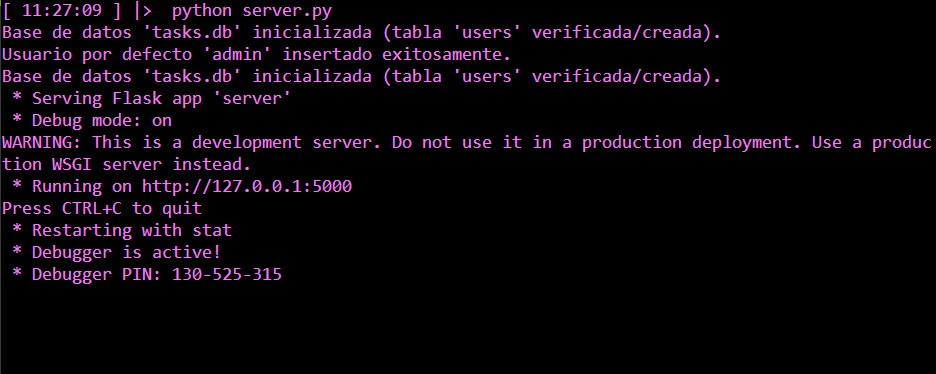
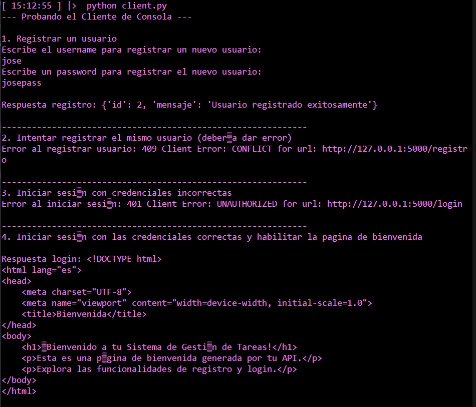
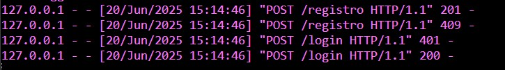

# Sistema de Gestión de Tareas (API y Consola)

Este proyecto es un sistema básico de gestión de tareas con autenticación de usuarios con encriptacion de contraseña, una API RESTful (Flask) y persistencia de datos (SQLite). Incluye un cliente de consola para interactuar con la API.

## Características

* **API RESTful:** Endpoints para registro, login y una página de bienvenida.
* **Autenticación Segura:** Hashing de contraseñas con `Werkzeug.security`.
* **Base de Datos:** SQLite (`tasks.db`) para almacenar usuarios. Se inicializa automáticamente e incluye un usuario `admin` por defecto.
* **Cliente de Consola:** `client.py` para interactuar con la API.

## Requisitos

* Python 3.x
* pip

## Pasos a seguir para despliegue en local - Abrir terminal
```bash
git clone https://github.com/smamby/pr-PFO2.git
cd pr-PFO2

### Instala las dependencias:
pip install Flask Werkzeug requests

### Inicializar server, la primera vez creara la base de datos y la tabla de usuraios
python server.py

### Inicializar cliente
python client.py

#### Al inicializar el cliente te pedira un username y password 
#### para hacer el test y demostracion del registro, login, manejo 
#### de errores y habilitacion a la pagina de bienvenida

#### registro y login manual con CURL
curl -X POST -H "Content-Type: application/json" -d '{"usuario": "nuevo_usuario", "password": "password_segura"}' http://127.0.0.1:5000/registro

curl -X POST -H "Content-Type: application/json" -d '{"usuario": "nuevo_usuario", "password": "password_segura"}' http://127.0.0.1:5000/login


Respuesta Conceptuales

¿Por qué hashear contraseñas?
Porque es una bulnerabilidad dejar contraseñas en texto plano en base de datos, a la vista de administradores y de potenciales agentes maliciosos.

Ventajas de usar SQLite en este proyecto.
Es una base de datos ultra liviana, que o require configuracion, ideal para pequeños proyectos de prueba como este, no esta diseñada para produccion


## Capturas de pantalla






